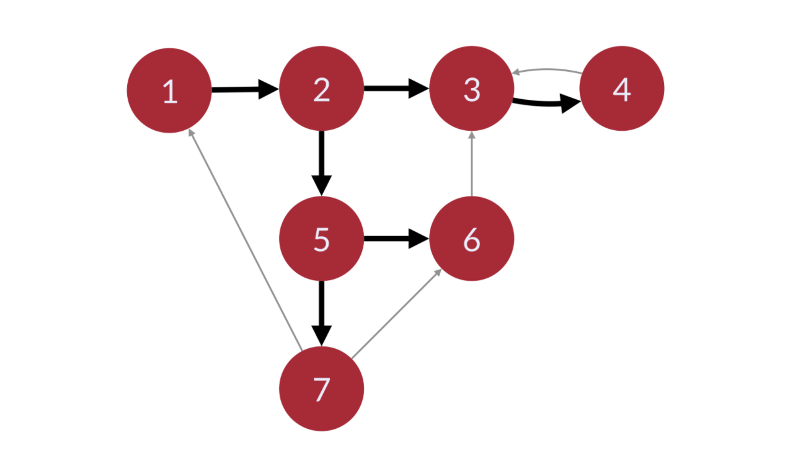

# Graphs

We will use the graph below and represent it in both an adjacency list and an adjacency matrix. (See graph.py)


## Breadth First Search

-   Explores the graph outward in rings of increasing distance from the starting vertex.
-   The algorithm never attempts to explore a vert it has already explored or is currently exploring.
-   When starting from the upper left, the numbers on the graph below show a vertex visitation order in a BFS:


-   We followed the edges represented by the thick black arrows. We did not follow the edges represented by the thinner grey arrows becasue we already visited their destination nodes
-   There is a difference between a breadth first search and a breadth first traversal
    -   A breadth first traversal is when you visit each vertex in breadth first order and do something during the traversal
    -   A breadth first search is when you search through vertexes in breadth first order until you find the target vertex. Usually returns the shortest path from the starting vertex to the target vertex once the target is found.

### Applications of BFS

-   Pathfinding, Routing
-   Find neighbor nodes in a P2P network like BitTorrent
-   Web crawlers
-   Finding people 'n' connections away on a social network
-   Find neighboring locations on graph
-   Broadcasting in a network
-   Cycle detection in a graph
-   Finding Connected Components
-   Solving several theoretical graph problems

### Coloring Vertexes

-   Unvisited verts are white
-   Verts whose neighbors are being explored are grey
-   Verts with no unexplored neighbors are black

Useful to track which nodes we need to follow up on. We can track that by adding neighbors to a queue (first in first out) and then explore the verts in the queue one by one.

### Pseudo-code for BFS

```Python
BFS(graph, startVert):
    # mark all verts as unvisited
    for v of graph.vertexes:
        v.color = white

    startVert.color = grey
        queue.enqueue(startVert) # first vert to be explored

    while !queue.isEmpty():
        u = queue[0] # Peek at head of queue, but dont dequeue

        for v of u.neighbors:
            if v.color == white:
                v.color = grey
                queue.enqueue(v)

        queue.dequeue()
        u.color = black
```

## Depth First Search

-   Searching algorithm that dives down the graph as far as it can before backtracking and exploring another branch
-   Never attempts to explore a vert it has already explored or is in the process of exploring
-   Starting form the upper left, numbers show a vertex visitation order in a DFS:
    

### Applications of DFS

-   Often the preferred method of exploring the graph if we want to ensure we visit every node in the graph
-   Path finding
-   Detect cycle in graphs
-   Solving and generating mazes

### Coloring Vertexes

-   Unvisited verts are white
-   Verts whose neighbors are being explored are grey
-   Verts with no unexplored neighbors are black

### Recursion

-   DFS will pursue leads in the graph as far as it can and then "back up" to an earlier branch.
-   Recursion is a good way to help "remember" where we left off

```Python
explore(graph) {
    visit(this_vert)
    explore(remaining_graph)
}
```

### Psuedo-code for DFS

```Python
DFS(graph):
    for v of graph.verts:
        v.color = white
        v.parent = null

    for v of graph.verts:
        if v.color == white:
            DFS_visit(v)

DFS_visit(v):
    v.color = grey

    for neighbor of v.adjacent_nodes:
        if neighbor.color == white:
            neighbor.parent = v
            DFS_visit(neighbor)

    v.color = black
```
