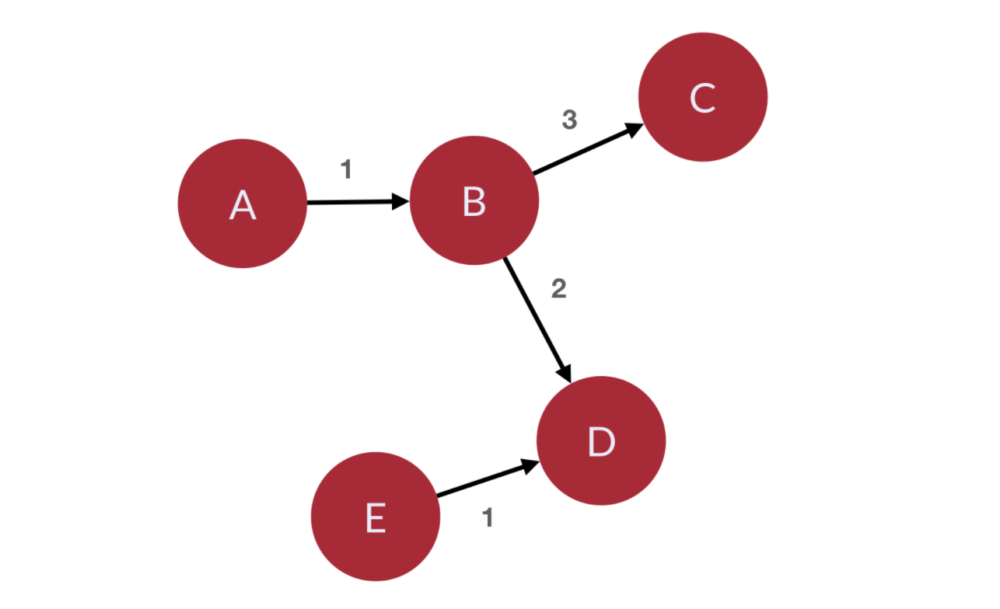
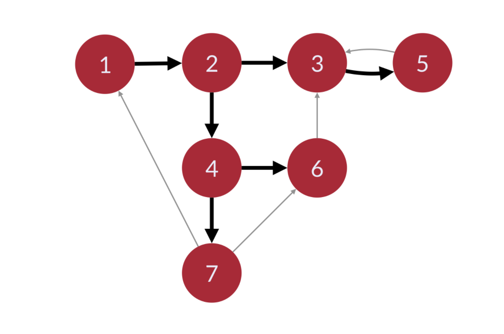

# Graphs

We will use the graph below and represent it in both an adjacency list and an adjacency matrix. (See graph.py)

## Breadth First Search

-   Explores the graph outward in rings of increasing distance from the starting vertex.
-   The algorithm never attempts to explore a vert it has already explored or is currently exploring.
-   When starting from the upper left, the numbers on the graph below show a vertex visitation order in a BFS:

-   We followed the edges represented by the thick black arrows. We did not follow the edges represented by the thinner grey arrows becasue we already visited their destination nodes
-   There is a difference between a breadth first search and a breadth first traversal
    -   A breadth first traversal is when you visit each vertex in breadth first order and do something during the traversal
    -   A breadth first search is when you search through vertexes in breadth first order until you find the target vertex. Usually returns the shortest path from the starting vertex to the target vertex once the target is found.

## Applications of BFS

-   Pathfinding, Routing
-   Find neighbor nodes in a P2P network like BitTorrent
-   Web crawlers
-   Finding people 'n' connections away on a social network
-   Find neighboring locations on graph
-   Broadcasting in a network
-   Cycle detection in a graph
-   Finding Connected Components
-   Solving several theoretical graph problems
