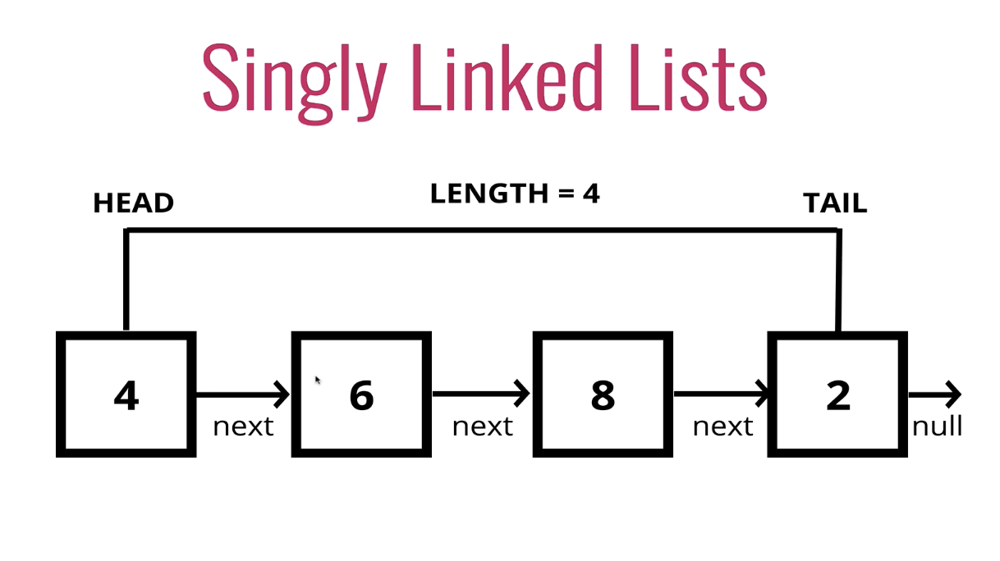

# Singly Linked List

-   A data structure that contains a head, tail, and length property.
-   Linked lists consist of nodes, and each node has a value and a single pointer to it's next node, or null if it is the tail.
-   Can only be traversed in one direction, they are _unidirectional_
-   Removing a node from the end of a singly linked list is a linear operation instead of a constant-time operation like in lists/arrays
-   Getting to any position in a singly linked list requires traversing from the head, even if the position we want to get is physically closer to the tail
    

## Lists vs Arrays

Lists

-   Unlike arrays, linked lists do not store elements contiguously in memory
-   Linked lists do not need to be allocated with a static amount of memory up front
-   Do not have indices
-   Connected via nodes with a next pointer
-   Random access is not allowed
-   Good at insertion and deletion

Arrays

-   Indexed in order
-   Insertion and deletion can be expensive
-   Can quickly be accessed at a specific index

## Node Properties

-   val = piece of data
-   next = reference to next node

## Linked List Properties and Methods

head = The first node
tail = The last node, it points to null or None
length = length of singly linked list

### Push

-   Pushing the first value creates a new node and it is assigned to the head and tail of the list
-   Pushing a second value creates a new node and it is assigned as the tail. The head node's next property will be assigned to the tail
-   Pushing a third value creates a new node, the current tail's next value becomes this new node and then this new node is assigned as the tail value in the linked list

#### Psuedo Code

-   function should accept a value
-   create a new node using the value passed to the function
-   if there is no head property on the list, set the head and tail to be the newly created node
-   otherwise set the next property on the tail to be the new node and set the tail property on the list to be the newly created node
-   increment length by one
-   return linked list

### Pop

-   Removes a node from the end of the list
-   Needs to traverese the list until it finds the second to last node, and then assign that as the tail and its next val to none/null

#### Psuedo Code

-   if there are no nodes in the list, return undefined
-   declare a variable, _current_, set as the head
-   declare a variable, _newTail_, set to _current_
-   loop through the list until you reach the tail
    -   while _current.next_ is not null or None:
        -   _newTail_ = current
        -   current = current.next
    -   Once current.next is null or None, _newTail_ will be the second to last node
-   set the next property of _newTail_ to be null or None
-   set the tail to be _newTail_
-   decrement the length of the list by one
-   if the length now = 0, set head and tail to null or None
-   return the value of the node removed

### Shift

-   Removes node from the beginning of the list

#### Pseudo Code

-   if there are no nodes, return undefined
-   store the current head property in a variable
-   set the head property to be the current head's next property
-   decrement length
-   if the length is now 0, set tail to null or None
-   return the value of the node removed

### Unshift

-   Adds a new node to the beginning of the list

#### Pseudo Code

-   function should accept a value
-   create a new node using the value passed into the function
-   if there is no head property, set the head and tail to the newly created node
-   otherwise set the newly created node's next property to be the current head property on the list
-   set the head property on the list to be the newly created node
-   increment the length
-   return the linked list

### Get

-   Retrieves a node by its position in the linked list

#### Pseudo Code

-   function should accept an index
-   if the index < zero or index >= length, return null
-   loop through the list until you reach the index and return the node at that index

### Set

-   Changed the value of a node based on its position in the linked list

#### Pseudo Code

-   function should accept a value and an index
-   use the get method to find the specific node
-   if the node is not found, return false
-   if the node is found, set the value of that node to be the value passed to the function and return true

### Insert

-   Add a node to the linked list at a specific position

#### Pseudo Code

-   if index < 0 or index > length, return false
-   if index === length, push a new node to the end
-   if index === 0, unshift a new node to the start of the list
-   otherwise, using the get method, access the node at the index - 1 (the node that will point to the inserted node)
-   set the next property on that node to be the new node
-   set the next property on the new node to the previous node's next
-   increment the length
-   return true

### Remove

-   removes a node from the list at a specific position

#### Pseudo Code

-   if index < 0 or index > length, return undefined
-   if index === length, pop
-   if index === 0, shift
-   otherwise, using get method, access the node at the index - 1
-   set the next property on that node to be the next of the next node
-   decrement the length
-   return value of the removed node

### Reverse

-   reverse the linked list in place

#### Pseudo Code

-   swap the head and the tail
-   create a variable named next and prev
-   create a variable named node and initialize it to the head property
-   loop through the list
-   set next to be the next property on whatever node it is on
-   set the next property on the node to be whatever prev is
-   set prev to be the value of the node variable
-   set the node variable to be the value of the next variable

## Big O

-   insert: O(1)
-   remove: It depends...O(1) (from biginning) or O(N)
-   search: O(N)
-   access: O(N)
